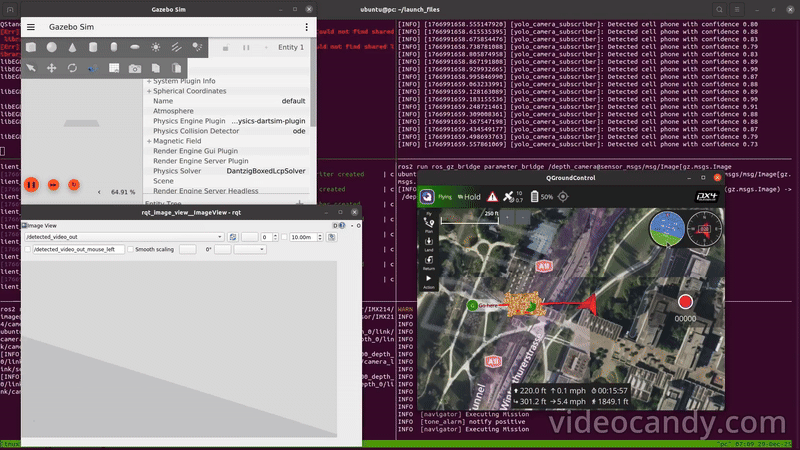

# UAV Simulation with PX4, ROS2 & Micro XRCE-DDS

Environment for running UAV simulations with **PX4 1.16.0**, **ROS2**, **Gazebo**, and **Micro XRCE-DDS**, including the **PX4-ROS2 bridge**.  
---

## Features

- Fully containerized PX4 SITL environment for Ubuntu 22.04.
- RGB and Depth sensor enabled for multirotor X500.
- GPU based YOLO v8 object detection.
- 2D lidar scanning.


## Directory Structure

```
PX4_1.16_ROS2_XRCE_DDS/
├── docker/
    └── Dockerfile
    └── entrypoint.sh
    └── run.sh
    └── build.sh
    └── scripts
        └── ..
└── launch_files/
    └── single_x500_object_detection.sh
    └── single_vtol.sh
    └── single_x500_lidar_icp.sh
    └── single_x500_down_offboard.sh
└── resources/
    └── gz_models/
    └── gz_worlds/
    └── patches/
    └── ros_packages/
        └── camera_subscriber/
            └── ..
        └── px4_tf_bridge/
            └── ..
        └── road_segmentation/
            └── ..
        └── slam_toolbox.yaml
    └── rviz
        └── ..
└── assets
    └── ..
└── README.md

```

---

## Installation 

### Clone and build

```bash
git clone https://github.com/rrajnidhi/px4_1.16_ros2_xrce_dds.git
cd px4_1.16_ros2_xrce_dds/docker
./build.sh
```

---

## Launch container

To start and enter the docker container 

```bash
./run.sh
```
---

## Launch simulation

### A. Object detection on x500_depth Quadcopter

Once inside to launch PX4 SITL + ROS2 Bridge + Micro XRCE-DDS with YOLO v8 object detection in custom world :

```bash
cd /launch_files
./single_x500_object_detection.sh
```
Caution: This currently detects NVIDIA GPU and runs on it if availbale. Fallback is CPU, but this can saturate the processor.

#### Demonstration Videos : 

Here are the links to GPU-Accelerated tests.

| Sample video | Full simulation |
|-----------------------|---------------------|
|  | [](https://youtu.be/d1SfdvVCJaI) |
---

### B. Lidar 2D Scan on x500_lidar
    
To launch PX4 SITL + ROS2 Bridge + Micro XRCE-DDS with lidar scan 2D in custom world

```bash
cd /launch_files
./single_x500_lidar_icp.sh
```

Illustration

Note: How to visualise ?

The tmux script loads a tested rviz config file. Be mindful while changing the rviz settings there. Description is as follows. 

a. In Rviz Displays -> Global Options -> Fixed Frame , enter "x500_lidar_2d_0/link/lidar_2d_v2". And in topic section "/world/default/model/x500_lidar_2d_0/link/link/sensor/lidar_2d_v2/scan". 

b. Apply frame. To find the frame : ros2 topic echo /world/walls/model/x500_lidar_2d_0/link/link/sensor/lidar_2d_v2/scan --once 
        and  look for header: frame_id: "xxxxx". Use that exact frame_id as the Fixed Frame in RViz. This will display everything from lidar frame.
        To set global map view, set map as Fixed Frame.


#### Demonstration Video : 

Here are the links to watch the SITL simulation video of 2D lidar activated on x500_2d_lidar multirotor UAV.

| Sample video | Full simulation |
|-----------------------|---------------------|
|  | [](https://youtu.be/PN5amXc8q8o) |

---

### C. Drone following road using image segmentation

To launch PX4 SITL + ROS2 Bridge + Micro XRCE-DDS with a x500_mono_cam_down and navigate the uav offboard following the center of road using image segmentation.

```bash
cd /launch_files
./single_x500_down_offboard.sh
```

---

### D. VTOL landing using camera


To launch PX4 SITL + ROS2 Bridge + Micro XRCE-DDS with a standard VTOL with downward looking camera.

    TBA

---

### List PX4 topics

```bash
ros2 topic list
```

---

### List gz topics

```bash
gz topic -l
```

---

## Maintainer

**Nidhi Raj**
[nidhirajr@gmail.com](mailto:nidhirajr@gmail.com)

---

## Acknowledgements

* [PX4 Autopilot](https://github.com/PX4/PX4-Autopilot)
* [ROS 2 Humble](https://docs.ros.org/en/humble/)
* [Gazebo Sim](https://gazebosim.org/)
* [Micro XRCE-DDS](https://github.com/eProsima/Micro-XRCE-DDS-Agent)

---

> Enjoy! 
> If you find this project useful, please consider giving it a ⭐